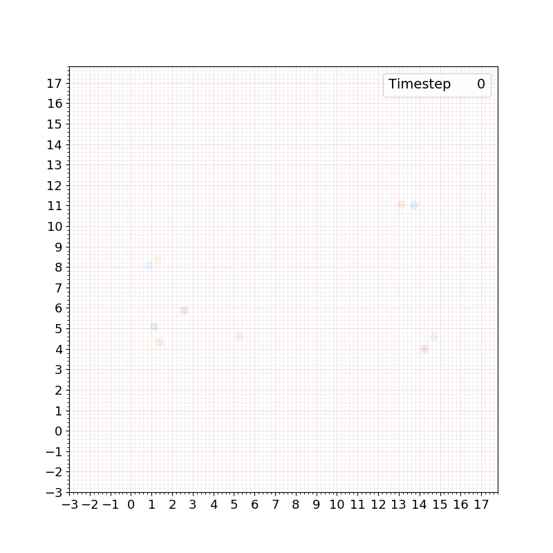

# Social-Navigation-Algorithm-Toolkit
**A collection of social navigation algorithms with minimal examples, easy integration with external system.**

Currently supported algorithms:  
* CADRL  
* Socialforce  
* RVO  
* and more.

### Project Contributors  
Sam Shum (cshum@andrew.cmu.edu) and Dr. Jean Oh

---
### Library Requirement and Suggested Version
* numpy (numpy==1.18.1)
* pytorch (torch==1.3.1)
* Python-RVO2 [here](https://github.com/mit-acl/Python-RVO2/tree/56b245132ea104ee8a621ddf65b8a3dd85028ed2)

---
### Example Usage
```bash
python example_cadrl.py
```
  

---

```bash
python example_rvo.py
```
  

---

```bash
python example_socialforce.py
```
  

---
### References

**Social LSTM**  
Alahi, A., Goel, K., Ramanathan, V., Robicquet, A., Fei-Fei, L., & Savarese, S. (2016). Social lstm: Human trajectory prediction in crowded spaces. In Proceedings of the IEEE conference on computer vision and pattern recognition (pp. 961-971).  
[link to paper](https://openaccess.thecvf.com/content_cvpr_2016/html/Alahi_Social_LSTM_Human_CVPR_2016_paper.html)

**Social GAN**  
Gupta, A., Johnson, J., Fei-Fei, L., Savarese, S., & Alahi, A. (2018). Social gan: Socially acceptable trajectories with generative adversarial networks. In Proceedings of the IEEE Conference on Computer Vision and Pattern Recognition (pp. 2255-2264).  
[link to paper](https://arxiv.org/abs/1803.10892)

**Social Force Model**  
Helbing, D., & Molnar, P. (1995). Social force model for pedestrian dynamics. Physical review E, 51(5), 4282.  
[link to paper](https://arxiv.org/abs/cond-mat/9805244)

**ORCA (RVO2)**  
Snape, J., Guy, S. J., Van Den Berg, J., & Manocha, D. (2014). Smooth coordination and navigation for multiple differential-drive robots. In Experimental Robotics (pp. 601-613). Springer, Berlin, Heidelberg.  
[link to paper](https://link.springer.com/chapter/10.1007/978-3-642-28572-1_41)

**Social-STGCNN**
Mohamed, A., Qian, K., Elhoseiny, M., & Claudel, C. (2020). Social-stgcnn: A social spatio-temporal graph convolutional neural network for human trajectory prediction. In Proceedings of the IEEE/CVF Conference on Computer Vision and Pattern Recognition (pp. 14424-14432).  
[link to paper](https://openaccess.thecvf.com/content_CVPR_2020/html/Mohamed_Social-STGCNN_A_Social_Spatio-Temporal_Graph_Convolutional_Neural_Network_for_Human_CVPR_2020_paper.html)

**Constant Velocity Model (CVM)**  
Schöller, C., Aravantinos, V., Lay, F., & Knoll, A. (2020). What the constant velocity model can teach us about pedestrian motion prediction. IEEE Robotics and Automation Letters, 5(2), 1696-1703.  
[link to paper](https://ieeexplore.ieee.org/abstract/document/8972605?casa_token=5Eby3flWY1IAAAAA:sjTaJbAjP_dSKMA6kDT21HA6fTdyF1ucqWC9LeW-eYk45bDPeYR9BobApeI74UPL8W8VgwuYfg)

**Social-PEC (SPEC)**  
Zhao, D., & Oh, J. (2020). Noticing Motion Patterns: Temporal CNN with a Novel Convolution Operator for Human Trajectory Prediction. IEEE Robotics and Automation Letters.  
[link to paper](https://ieeexplore.ieee.org/abstract/document/9309403/?casa_token=pV4aFJU4-0UAAAAA:NRC5vkADgA7Jd4cmX9HcV4pXuqBxQxAx8-GugQIVSSiTqpOiehJZW1TYo4dBlLUDNWwxHDCCZg)


---
### Implementation References

Social Force Implementation modified from [here](https://github.com/svenkreiss/socialforce)  
Social LSTM Implementation modified from [here](https://github.com/quancore/social-lstm)  
Social GAN Implementation modified from [here](https://github.com/agrimgupta92/sgan)  
Social STGCNN Implementation modified from [here](https://github.com/abduallahmohamed/Social-STGCNN)  
Constant Velocity Model modified from [here](https://github.com/cschoeller/constant_velocity_pedestrian_motion)  
CADRL Implementation from [here](https://github.com/mit-acl/gym-collision-avoidance)  
RVO2 Implementation from [here](https://github.com/mit-acl/gym-collision-avoidance), [here](https://github.com/mit-acl/Python-RVO2/tree/56b245132ea104ee8a621ddf65b8a3dd85028ed2)  


---
